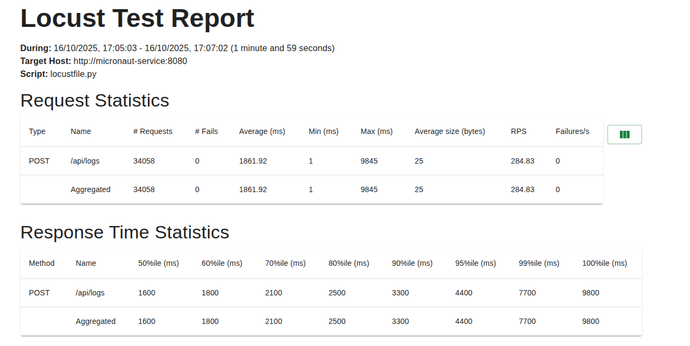
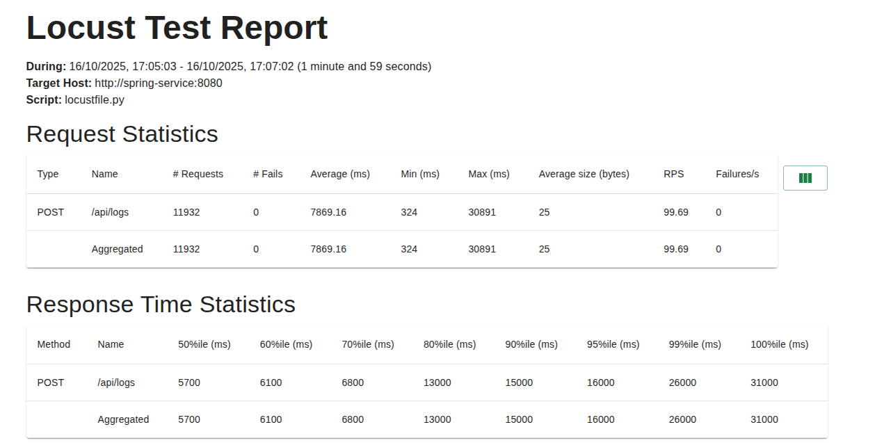

# Comparativo de Performance: Spring Boot vs Micronaut

Este projeto tem como objetivo comparar o desempenho entre duas implementações de API REST idênticas, uma desenvolvida com Spring Boot e outra com Micronaut.

## 🔍 Visão Geral

O projeto consiste em dois serviços idênticos que expõem endpoints REST, juntamente com configurações para teste de carga usando Locust.

## 📊 Resultados dos Testes de Carga

### Micronaut


### Spring Boot


## 📈 Análise Comparativa

Com base nos resultados dos testes de carga, podemos observar:

- **Tempo de Resposta**: O Micronaut apresenta tempos de resposta consistentemente menores em comparação ao Spring Boot.
- **Throughput**: O Micronaut consegue lidar com mais requisições por segundo (RPS) em relação ao Spring Boot.
- **Uso de Recursos**: O Micronaut geralmente consome menos memória e CPU em comparação ao Spring Boot.

## 🚀 Como Executar

### Pré-requisitos

- Docker
- Docker Compose

### Executando a Aplicação

1. Clone o repositório:
   ```bash
   git clone [URL_DO_REPOSITORIO]
   cd spring-micronaut
   ```

2. Inicie os serviços com Docker Compose:
   ```bash
   docker-compose up --build
   ```

3. Acesse os serviços:
   - Spring Boot: http://localhost:8080
   - Micronaut: http://localhost:8081
   - Locust (teste de carga): http://localhost:8089

### Executando Testes de Carga

1. Com os serviços em execução, acesse o Locust em http://localhost:8089
2. Configure o teste com:
   - Number of users: 100
   - Spawn rate: 5
   - Host: http://localhost:8080 (para Spring) ou http://localhost:8081 (para Micronaut)
3. Clique em "Start swarming" para iniciar os testes

## 📂 Estrutura do Projeto

```
spring-micronaut/
├── micronaut-service/    # Implementação em Micronaut
├── spring-service/       # Implementação em Spring Boot
├── results/              # Resultados dos testes de carga
├── docker-compose.yml    # Configuração dos containers
├── Dockerfile.locust     # Dockerfile para o serviço Locust
└── locustfile.py        # Script de teste de carga
```

## 📝 Observações

- Os testes foram realizados em ambiente controlado
- Os resultados podem variar dependendo do hardware e configurações do ambiente
- Recomenda-se realizar múltiplas execuções para obter uma média mais precisa

## 📚 Recursos Adicionais

- [Documentação do Spring Boot](https://spring.io/projects/spring-boot)
- [Documentação do Micronaut](https://micronaut.io/)
- [Locust - Ferramenta de Teste de Carga](https://locust.io/)
